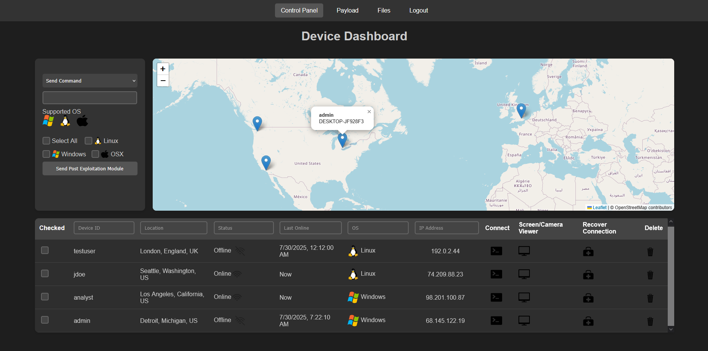
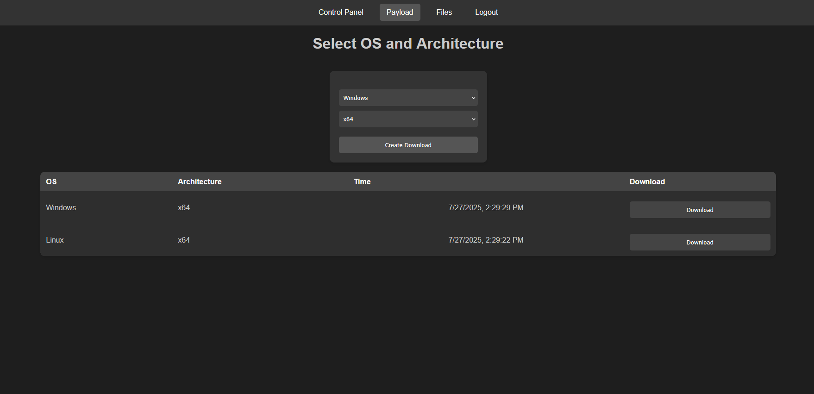
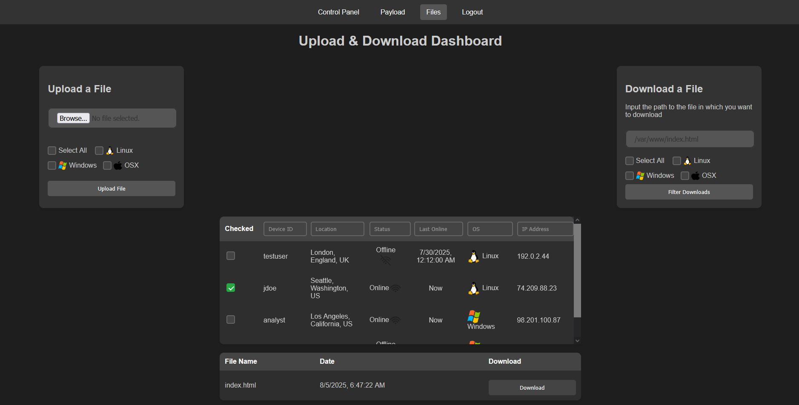
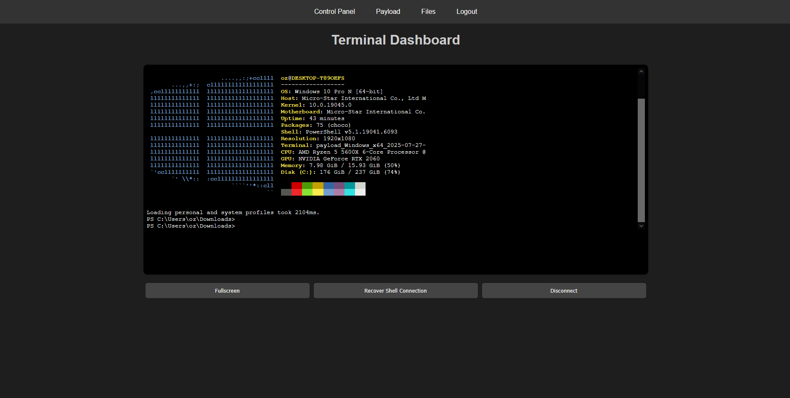

[//]: # ()

# 🎯 DRILL: Advanced C2 Framework v3.0

**DRILL** (Distributable Remote Integrated Lightweight Link) is a powerful and stealthy Command and Control (C2) framework designed for seamless operation across various environments.

## 🚀 Key Features

### 🌐 WebSocket Communication
DRILL utilizes WebSocket protocol for C2 communications, effectively bypassing firewalls and proxies. This allows for real-time, bidirectional communication between the agent and the server, enhancing stealth and efficiency.

### 🔌 Single Port Operation
All traffic flows through a single port using HTTP/HTTPS, simplifying network traversal and making it easier to disguise as legitimate traffic.

### 🔐 Encrypted Communications
DRILL now supports full encryption of traffic between the client and the server using **AES** and **RSA**, securing sensitive information in transit.

### ☁️ Cloudflare Tunnel Compatibility
DRILL can be easily tunneled through Cloudflare, providing an additional layer of security and obfuscation for C2 communications.

### 🐳 Cross-Platform Payload Generation
Built-in Docker integration enables seamless payload creation for both Linux and Windows targets.  
*Note: MacOS support has been temporarily removed but will return soon.*

### 🔒 Robust Persistence Mechanisms
- **Windows**: Implements startup registry keys and PowerShell profile modifications (PowerShell profile is temporarily disabled due to a bug)
- **Linux**: Creates a user-local systemd process for persistent access
- **OSX**: Previously supported via launch agents (support temporarily removed)

### 📂 Advanced File Transfer Capabilities
- Send and receive files to/from single or multiple machines simultaneously
- Supports transfer of executable files, enhancing post-exploitation flexibility

### 🛠️ Post-Exploitation Modules (PEM)
- Easily create and load your own modules by defining a `run()` function
- Modules must be configured in `config.json` with unique `disconnect-uid` values per module
- PEMs cannot use non-standard Python modules

```json
"disconnect-uid": {
    "os": ["windows", "linux", "osx"],
    "pem_path": "stop.py",
    "pem_name": "Disconnect Device"
}
```

### 🧠 Resilient Recovery Process
A secondary background process is now spawned automatically. It enables use of the **Recover** button even if the main executable has been killed on the client side.

### 🧽 Clean Uninstallation
A new **Delete** button fully removes the payload from the client machine and uninstalls persistence mechanisms, ensuring a clean exit.

### 🎨 Redesigned User Interface
Version 3.0 features a completely overhauled UI, improving usability and efficiency for operators.

### 🖥️ Remote Desktop Control (NEW)
- View the target user's screen in real time
- Send mouse and keyboard inputs to the target machine

### 📷 Webcam Access
If the client device has a camera, DRILL can access the first camera feed.

---

## 📸 Screenshots

### Main Dashboard


### Payload Generation


### File Upload/Download


### Console of Connected Device


---

## 🏗️ Architecture

DRILL follows a typical C2 framework architecture:

1. **Agent**: Malware running on targeted systems, connecting back to the teamserver
2. **Teamserver**: Central backend service managing agent communications and operator interactions
3. **Client**: Web interface for operators to control the teamserver and issue commands

---

## 📥 Installation

```bash
# Clone the repo
git clone https://github.com/redteam-malware/DRILL_V3.git

# Run the installer, avoid running it as root
cd DRILL_V3
bash ./install.sh
```

We recommend not running DRILL V3 behind a proxy as it can cause IP grabbing issues. Use an open port or tested services like ngrok or Cloudflare Tunnels.

---

## 🖥️ Usage

```bash
# Basic usage example
python3 main.py
```

---

## 🔑 Change Username and Password

To change the default credentials, modify the configuration file located at `config.json`:

```bash
nano config.json
```

---

## ⚠️ Security Considerations

> **Warning**: This tool is intended for authorized penetration testing and red team operations only. Misuse of this software may be illegal in your jurisdiction. Use responsibly and ethically.

---

## 📜 License

Apache-2.0 license

---

## ❗ Disclaimer

This project is for educational and authorized testing purposes only. The authors are not responsible for any misuse or damage caused by this software.

---

<details>
<summary>📊 Project Stats</summary>

## Star History

<a href="https://star-history.com/#Dark-Avenger-Reborn/DRILL_V3&Date">
 <picture>
   <source media="(prefers-color-scheme: dark)" srcset="https://api.star-history.com/svg?repos=Dark-Avenger-Reborn/DRILL_V3&type=Date&theme=dark" />
   <source media="(prefers-color-scheme: light)" srcset="https://api.star-history.com/svg?repos=Dark-Avenger-Reborn/DRILL_V3&type=Date" />
   
 </picture>
</a>

</details>
